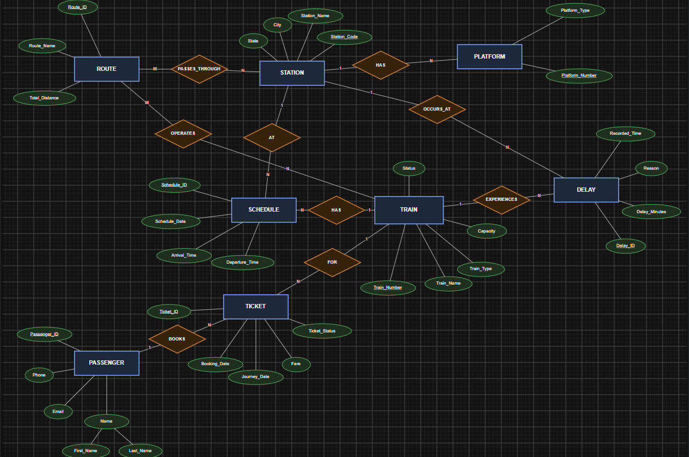

# Railway Network & Dynamic Train Scheduling System

A full-stack DBMS project that manages railway trains, routes, stations, platforms, schedules, passengers, tickets, and train delays — with a dynamic scheduling feature that automatically recalculates affected timings when a delay is recorded.

## Tech Stack

- **Frontend:** React.js (Vite) + React Router
- **Backend:** Node.js + Express.js
- **Database:** PostgreSQL
- **API:** REST

## Project Structure

```
railway-scheduling-system/
├── database/           # Schema, seed data, views, triggers, stored procedures
├── backend/             # Express REST API
│   └── src/
│       ├── config/       # DB connection pool
│       ├── controllers/  # Business logic per entity
│       └── routes/       # Express route definitions
├── frontend/            # React app
│   └── src/
│       ├── pages/        # One page per module (Trains, Stations, etc.)
│       ├── components/   # Shared UI components (ConfirmModal)
│       └── services/     # Centralized API client
└── docs/                # ER diagram and documentation
```

## Features

- Full CRUD for trains, stations, routes, schedules, passengers, and tickets
- Many-to-many relationships (train↔route, route↔station) via junction tables
- Ticket booking wrapped in a database transaction (`book_ticket()`)
- **Dynamic scheduling**: recording a delay automatically flags the train as "Delayed" (via trigger) and recalculates every affected downstream schedule (via `record_delay_and_get_impact()`)
- Reports & analytics: revenue per train, delay statistics, station traffic, longest delays
- Audit logging of train status changes

## Database Setup

1. Create the database:
   ```bash
   psql -U postgres -c "CREATE DATABASE railway_db;"
   ```

2. Run the SQL files **in this exact order**:
   ```bash
   psql -U postgres -d railway_db -f database/schema.sql
   psql -U postgres -d railway_db -f database/seed-data.sql
   psql -U postgres -d railway_db -f database/views.sql
   psql -U postgres -d railway_db -f database/triggers.sql
   psql -U postgres -d railway_db -f database/procedures.sql
   ```

## Backend Setup

```bash
cd backend
npm install
```

Create a `.env` file (see `.env.example`):
```
PORT=5000
DB_HOST=localhost
DB_PORT=5432
DB_NAME=railway_db
DB_USER=postgres
DB_PASSWORD=your_password
```

Run the server:
```bash
npm run dev
```

Verify it's working: `http://localhost:5000/health`

## Frontend Setup

```bash
cd frontend
npm install
```

Create a `.env` file (see `.env.example`):
```
VITE_API_BASE_URL=http://localhost:5000/api
```

Run the dev server:
```bash
npm run dev
```

Open `http://localhost:5173`

## API Overview

| Module | Base Route | Notes |
|---|---|---|
| Trains | `/api/trains` | Full CRUD |
| Stations | `/api/stations` | Includes `/:code/platforms` |
| Routes | `/api/routes` | Includes `/:id/stations`, `/:id/trains` |
| Schedules | `/api/schedules` | Supports `?date=YYYY-MM-DD` filter |
| Passengers | `/api/passengers` | Includes `/:id/tickets` |
| Tickets | `/api/tickets` | Booking uses `book_ticket()` transaction |
| Delays | `/api/delays` | Recording uses `record_delay_and_get_impact()` |
| Reports | `/api/reports` | Dashboard summary, revenue, delay stats |

## Database Design Notes



- **3NF normalized** schema with proper PK/FK/CHECK/UNIQUE constraints
- Two junction tables handle the M:N relationships: `train_route` and `route_station` (the latter includes `sequence_number` for ordered stops)
- A `schedule` row represents one train's stop at one station on a given date — this is how it connects both to `train` (1:N) and `station` (N:1)
- Triggers enforce: auto-updating train status on delay, ticket date/fare validation, and an audit trail of status changes

## Known Notes

- Seed data uses `CURRENT_DATE` at the time it's run — if schedule dates look stale after time passes, re-run `seed-data.sql` (after truncating tables) to refresh them.